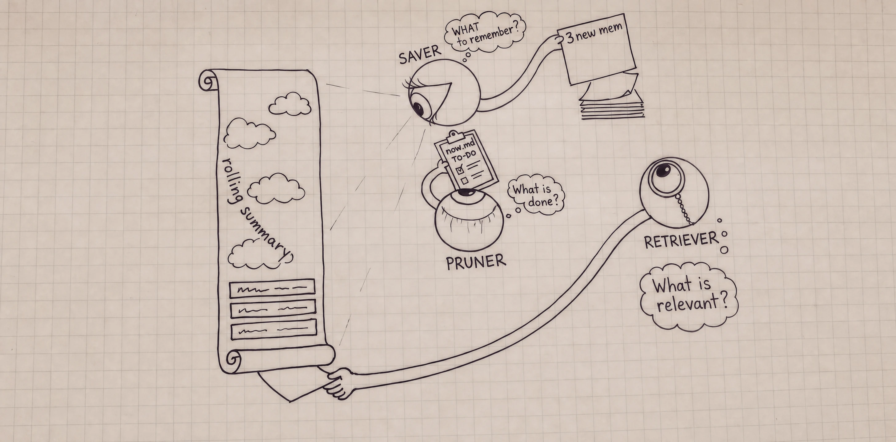

# hermes-plugin-stack-memory



A [Hermes](https://github.com/NousResearch/hermes-agent) memory-provider plugin for a git-backed
markdown memory store that an agent maintains and reads. The plugin is program (engine, schema,
saver); the store is data only. Memorizing and remembering run in the background.

## Setup

```sh
hermes plugins install Karb-Interactive/hermes-plugin-stack-memory --enable
hermes config set memory.provider stack
hermes memory setup
hermes config set auxiliary.<component>.{provider,model}
hermes gateway restart

hermes -p <profile> plugins install <repo>     # install into a named profile
```

Models are set separately from `hermes memory setup` because they are not part of the provider's own
config schema. On first run the plugin creates and commits its own store at `$HERMES_HOME/memories/stack`
(normally `~/.hermes/memories/stack`). Needs `uv` and `git` on PATH and a configured Git name/email.
Each profile installs the plugin itself and gets its own store. `hermes memory setup` is where you set
`cadence`, `max_iterations`, the store, and the dataset option.

## Models

Stack makes three model calls. By default each inherits your main model; each can be routed to its
own. The retriever and summarizer are quick, no-tool calls — favor speed. The saver is a
judgment-heavy tool loop that edits the store — favor capability.

```sh
hermes memory setup                       # interactive; sets all three

# or set them directly — the example config used by @vykhovanets:
hermes config set auxiliary.retriever.provider ollama-cloud
hermes config set auxiliary.retriever.model nemotron-3-super     # fast; no tools
hermes config set auxiliary.summarizer.provider ollama-cloud
hermes config set auxiliary.summarizer.model nemotron-3-super    # fast; no tools
hermes config set auxiliary.saver.provider ollama-cloud
hermes config set auxiliary.saver.model glm-5.3-flash             # agentic; edits the store
```

`hermes config set` warns that the `auxiliary.*` paths are unrecognized keys — expected, they are
read by the plugin, not core. The saver ignores any `timeout` set under `auxiliary.*`.

## How it works

Four beats, all in the background:

1. **Session start** — injects the store's context (`now.md`, `user.md`, the index) once, as a stable
   system-prompt block served from the prompt cache.
2. **Every turn** — the retriever picks ≤3 relevant pages and injects their current bodies.
3. **Every few turns** — the saver decides what is durable, searches existing memory before writing,
   edits what it finds, commits, then reconciles `now.md`. Pending turns are also flushed at session
   end and before compression. A run may legitimately save nothing.
4. **Curation** — the main agent is given no stack tools (`get_tool_schemas()` returns `[]`); store
   writes go through the background saver.

| Component | Slot | Job | Shape |
|---|---|---|---|
| Retriever | `auxiliary.retriever` | ≤3 relevant pages per message | one call, no tools |
| Summarizer | `auxiliary.summarizer` | compresses the rolling context the saver reads | one call, no tools |
| Saver | `auxiliary.saver` | writes durable facts; reconciles `now.md` | agent: search · read · patch · terminal |

## Stores

A store is data only — `wiki/` + `config.json` + git history. To share one across profiles, point
them at the same absolute `repo_path`. It is an ordinary git repository: back it up by pushing it,
and a local-only store is legal. `engine.py doctor` warns when the branch has no upstream. On first
run the plugin commits the new store; the saver also pulls, commits, and pushes it.

**Share a store with a team via submodules.** Any `wiki/<org>/` folder can be a git submodule (a
checkout under `wiki/`, backed by its own repo), so teammates pull the same shared knowledge while
the rest of the store stays private:

```sh
git -C <store> submodule add <org-wiki-repo> wiki/<org>   # e.g. git@github.com:acme/wiki-acme.git
git -C <store> commit -am "add shared wiki/<org>"
```

Submodules are pulled at session start; the saver pulls, commits, and pushes them with your
credentials. `engine.py doctor` reports a submodule that is uninitialized, behind, or ahead.

## Configuration

| Key | Default | Where | Effect |
|-----|---------|-------|--------|
| `memory.provider` | `""` | `config.yaml` | Must be `stack`; with `""` the plugin never loads. |
| `memory.stack.cadence` | `4` | `config.yaml` | Completed exchanges between saver runs. Lower = more frequent, more tokens. |
| `memory.stack.max_iterations` | `18` | `config.yaml` | Tool-call budget for one saver run. A fact-dense session can exhaust a smaller budget mid-write (empty pages, no commit). |
| `memory.stack.dataset_enabled` | `false` | `config.yaml` | Writes a local debug/dataset file of raw turns and tool traces. Off by default. |
| `repo_path` | profile-local | `$HERMES_HOME/stack.json` | Store this profile reads/writes; an absolute path shares one store between profiles. Absent ⇒ `$HERMES_HOME/memories/stack`. |
| `auxiliary.{retriever,summarizer,saver}.{provider,model,api_key,base_url}` | main model | `config.yaml` | Route each component to its own model (see [Models](#models)). |

**Project-folder mapping** — the store's `config.json` (at the store root, git-ignored, absent by
default). To have Stack pick project context from the current directory and resolve source anchors,
copy `config.example.json` to `config.json` and map its org/project keys to local folders (`~` and
`$HOME` are supported, e.g. `"path": "$HOME/Code/acme"`):

```json
{"orgs": {"acme": {"is_container": true,
  "projects": {"widget": {"path": "$HOME/Code/acme/widget", "aliases": ["widget"]}}}}}
```

Recreate those paths when moving between machines; the wiki pages themselves are portable. This is
separate from `stack.json`, which selects the store.

## Data and permissions

- **Model calls** leave the machine with a remote provider: the retriever sends the message + page
  catalog, the saver the buffered excerpts + rolling summary + store paths + catalog, the summarizer
  the excerpts + previous summary; selected pages also reach the main model.
- **Local access:** the saver is a background tool-using agent under the Hermes process's
  permissions (search, read, patch, terminal). Not a sandbox; memory writes have no human gate. It
  does not pass YOLO/skip-approval or bypass Hermes approval guards. The `store_jail` guard is armed
  only on the saver's thread, so the main agent's own file and terminal tools are not confined to the
  store.
- **Containment:** a thread-scoped `pre_tool_call` guard blocks a destructive command (`rm`, `mv`,
  `cp`, `chmod`, `>`/`>>`, `sed -i`, …) naming an absolute path outside the store. It is
  shape-independent and fails open on relative paths, `cd` state, and in-process mutations; reads and
  executions stay open. A guard, not a sandbox — the store is the boundary and git is the undo.
- **Git:** the saver pulls, commits, and pushes the store with your credentials; a remote is
  optional, and `doctor` warns if the branch has none. Configure a remote for the intended audience
  — the plugin does not make one private. The opt-in `dataset_enabled` file (raw turns, no rotation)
  lives under `$HERMES_HOME/memories/.stack-provider/`; no outbound telemetry.

## Engine

`engine.py` (at `~/.hermes/plugins/stack/engine.py`) is the single runtime and is harness-neutral —
no Hermes imports; any harness can call it, and it need not be copied into a store. `check` and
`doctor` are the maintenance commands (run against a real store, e.g. `--repo ~/System/stack`):

```sh
uv run --no-project engine.py --repo <store> load    [cwd]   # context + page catalog
uv run --no-project engine.py --repo <store> resolve [cwd]   # cwd -> (org, project) + page set
uv run --no-project engine.py --repo <store> verify  <page>  # anchors -> verified|drifted|unknown
uv run --no-project engine.py --repo <store> check   [cwd]   # health: verify-all, dangling links, orphans
uv run --no-project engine.py --repo <store> create  ...     # write a page (stages; does not commit)
uv run --no-project engine.py --repo <store> doctor          # config, git state, submodules
uv run --no-project engine.py --repo <store> init            # create a minimal store at an absent path
```

## Develop

```sh
STACK_PROVIDER_DEBUG=1 hermes            # logs seams to $HERMES_HOME/logs/stack-provider.log
PYTHONPATH=$HOME/.hermes/hermes-agent:$HOME/.hermes/plugins \
  uv run --project $HOME/.hermes/hermes-agent --no-sync \
  python -m unittest discover -s tests -p 'test_*.py'
```

`tests/test_vocab.py` runs standalone; `tests/check_profile_store.py` exercises profile/store
resolution against temp `HERMES_HOME`s. Behaviour is defined by the code and tests; the old v1 spec
was deleted and lives in Git history.

## Principles

Own the data; the harness is a replaceable surface. Autonomy is additive-only. Raw sources stay
where they are — only extracted knowledge and anchors live in the store.
